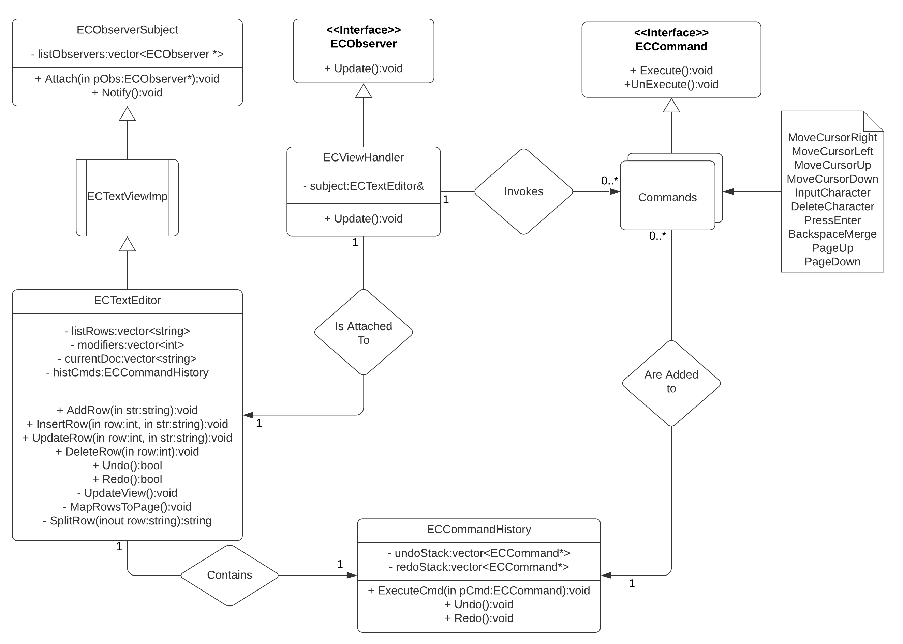

Created By Evan Weiss

CSE 3150-SEC001

Professor Yufeng Wu

May 5th, 2020

# Project Milestone 3 : Final Submission

## Section 1 & 2: Overview and User guide

### What to Download:
Download the Makefile and ECProject folder. This folder contains all project files. Make sure both the Makefile and ECProject folder
are in the same directory.

### Compilation and Execution:
Using a linux terminal, _cd_ into the folder containing the Makefile and ECProject folder. Type "make" into the command line and
execute. This will compile the files in the ECProject folder, and output them to an executable file called "project.exe". The program __requires__ exactly one command line argument. This argument will be the name of text file.

To execute the program: "./project.exe <file_name>.txt"

If the text file does exist, its text will be displayed within the text editor.

If the text file does not exist, a new file with that same name will be created in the current directory. The editor will be blank upon loading.

__Originally Tested Using:__ Cygwin64 (GNU version 8.26) terminal running on Windows 10.

### Key Features:
__The following is a table of the features that have been implemented in this version of the project.__

| Feature | Status | Design Pattern | User Guide | Function |
| ------- | ------ | -------------- | ---------- | -------- |
| Save & Quit | Implemented | n/a | Press Ctrl+q | Saves text in editor to file specified on CLI, then terminates application |
| Cursor Movement** | Implemented | Command | All four arrow keys supported | Moves cursor within the editor. Bound by line length and window size. Pressing down/up on the bottom/top of the window will skip to the next/previous page. | 
| Text Entry | Implemented | Command | All aplha-numeric characters + special characters | Adds the typed character to the screen at the cursor. Now supports line wrapping. |
| Enter | Implemented | Command | Press Enter | Adds newline / breaks line at the cursor location. Wrapped lines will be split into two separate lines. Entering at the bottom of the page will bring you to the next page. |
| Text Removal | Implemented | Command | Press Backspace | Deletes a character to the left of cursor. If pressed at the beginning of a row, it will append the current line to the end of the line above. | 
| Undo Action | Implemented | Observer / Command | Press Ctrl+z | Undoes previous action (repeatable) |
| Redo Action | Implemented | Observer / Command | Press Ctrl+y | Redoes previously undone action (repeatable) |
| Page Up | Implemented | Observer / Command | Press PgUp (Page Up) | Goes to the next page. |
| Page Down | Implemented | Observer / Command | Press PgDn (Page Down) | Goes to the previous page. |

\* = New feature.

\*\* = New functionality added to existing feature.

### Known Issues:
__The following is a list of known bugs and issues that have not been resolved as of the latest version of the project.__

_The exterminator was called and there are no known bugs_

## Section 3: Design Spec

### UML Class Diagram with Relationships:

